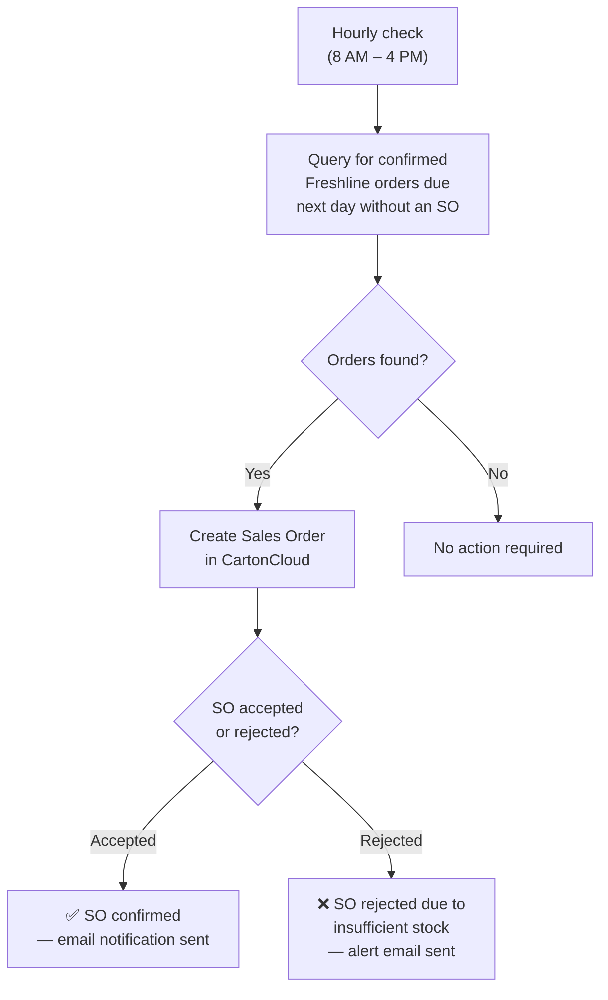
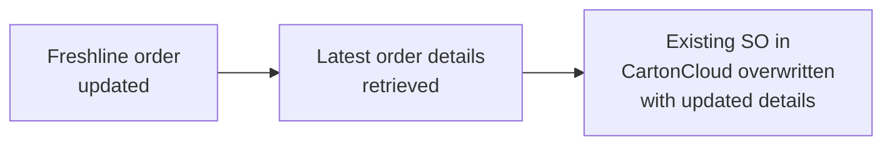
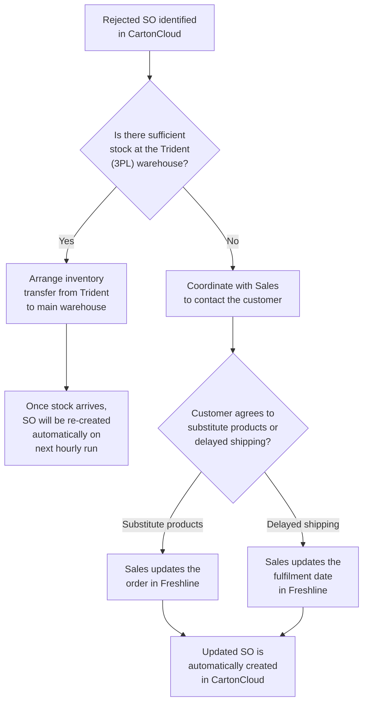

# Freshline → CartonCloud Sales Order Workflow

## Overview

Sales orders (SOs) in CartonCloud are **created and updated automatically** based on orders placed in Freshline. This document explains how the automation works at a high level, what happens when orders are rejected by CartonCloud, and what the warehouse operations team needs to do to manage rejected orders.

---

## How Sales Orders Are Created

Every hour between **8:00 AM and 4:00 PM**, the system checks for confirmed Freshline orders that are due for fulfilment the next day and do not yet have a corresponding Sales Order in CartonCloud. For each qualifying order, a Sales Order is automatically created in CartonCloud with the correct customer, delivery, and line item details.

Once a Sales Order is successfully created, the SO reference number is written back to the Freshline order so both systems stay linked.

---

## What Happens When a Freshline Order Is Updated

If a Freshline order that already has a Sales Order is modified (e.g. line items changed, delivery date updated), the system automatically retrieves the latest order details and **overwrites the existing Sales Order** in CartonCloud with the updated information.

This means the ops team does not need to manually update CartonCloud when changes are made in Freshline — the automation handles it.

---

## What Happens When a Sales Order Is Packed or Dispatched

When a Sales Order status changes to **Packed** or **Dispatched** in CartonCloud, the system automatically copies the **lot number** and **best-before date (BBD)** from the CartonCloud pick back to the Freshline order. This ensures traceability information appears on customer invoices without any manual data entry.

---

## Rejected Sales Orders — What Ops Needs to Do

### Why orders get rejected

CartonCloud will automatically reject a Sales Order if there is **insufficient stock** in the main warehouse to fulfil the order. When this happens, the ops team receives an **email alert** notifying them of the rejection.

### Where to find rejected orders

Rejected orders appear in the **Rejected tab** of the Sales Order view in CartonCloud:

👉 **[CartonCloud Sales Orders — Rejected Tab](https://app.cartoncloud.com/Knoxx_Foods/SaleOrders)**

The ops team should **check this view regularly** (at minimum, once each morning and once each afternoon) to ensure rejected orders are dealt with promptly.

### How to clear rejected orders

Each rejected order needs to be resolved through one of the following actions:

In summary, there are **two resolution paths**:

1. **Transfer stock from Trident (3PL) warehouse** — Check whether the required product is available at the third-party warehouse. If so, arrange a stock transfer to the main warehouse. Once the inventory is received, the next hourly automation run will pick up the order and create a new SO.

2. **Coordinate with Sales to update the order** — If stock is not available anywhere, work with the sales team to liaise with the customer. The customer may agree to either substitute products or a later delivery date. Sales then updates the order in Freshline accordingly, which will trigger an updated Sales Order to be created in CartonCloud automatically.

### Key point

Once the underlying issue is resolved (stock transferred or order updated in Freshline), **the automation will take care of creating the new Sales Order** — there is no need to manually create SOs in CartonCloud.

---

## Quick Reference

| Event | What happens automatically | Ops action required? |
|---|---|---|
| New confirmed order in Freshline (due next day) | SO created in CartonCloud | No |
| Freshline order updated after SO exists | Existing SO overwritten with new details | No |
| SO accepted by CartonCloud | Confirmation email sent | No |
| SO rejected by CartonCloud | Alert email sent | **Yes** — review and resolve |
| SO packed/dispatched | Lot number and BBD synced to Freshline | No |

---

## Contacts

- **Automation issues or questions about this workflow** — Contact Dennis (dennis@work.flowers)
- **Order or customer queries** — Contact the Sales team
